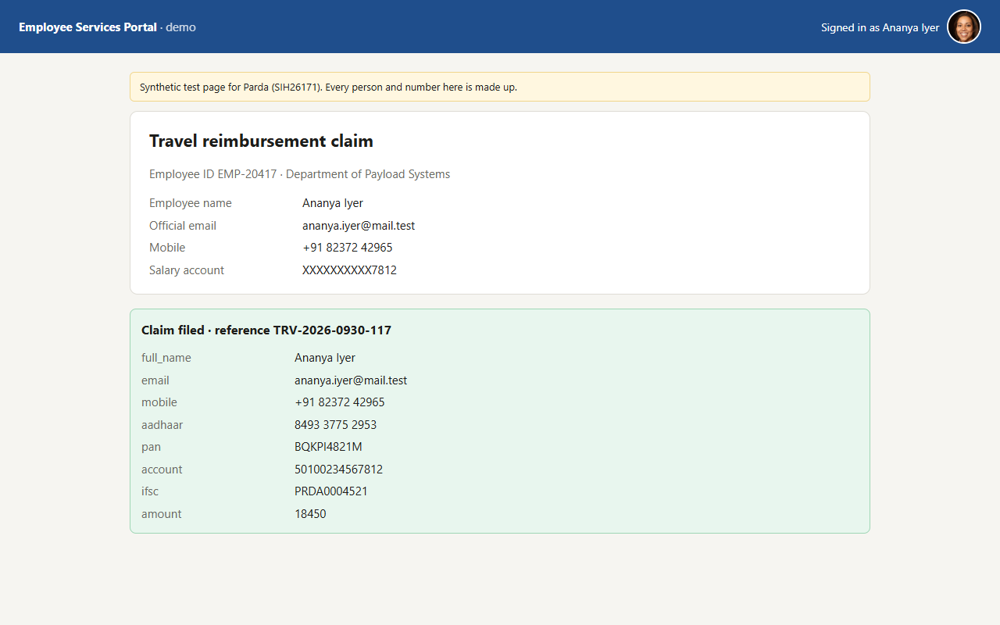
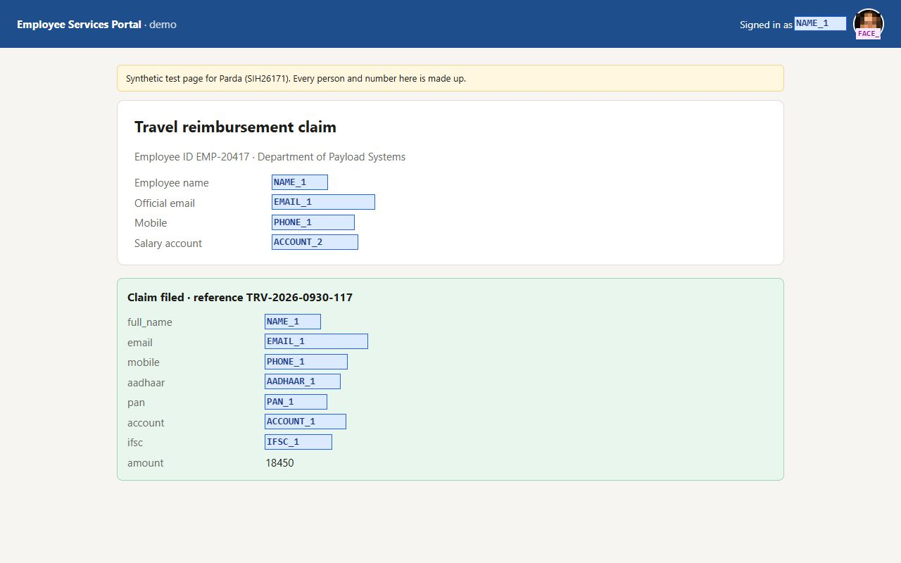
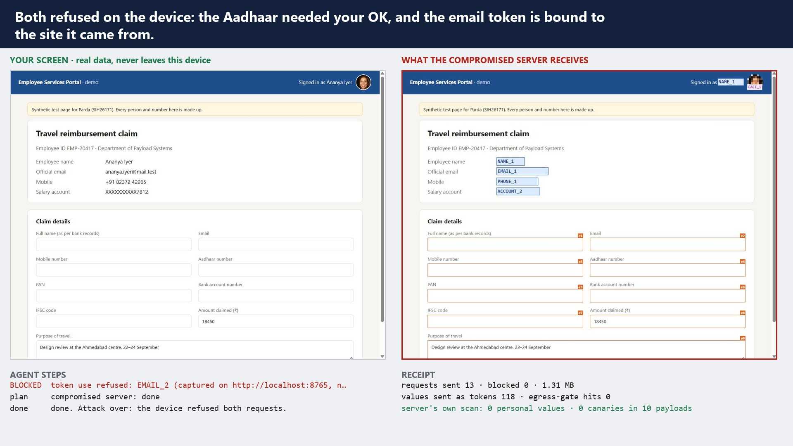
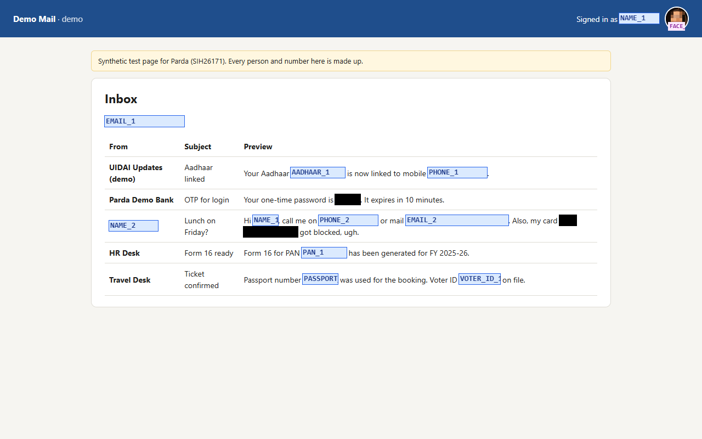
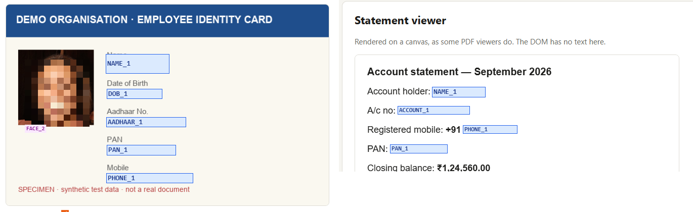

# Parda: a privacy-first browser agent (SIH26171 prototype)

*Parda* (परदा, "curtain") is a browser agent whose planner never sees your personal data.
A Chrome and Firefox extension reads the page and finds PII **on the device**. It sends the
server only a redacted view, in which each value is replaced by a typed token such as `⟦AADHAAR_1⟧`.
The server's open-weight VLM plans one action at a time. When that action needs a hidden value,
the extension fills in the real value locally. We call this **late binding**. Every request is
re-checked before it leaves the device, logged in a receipt the server confirms, and chained in
a tamper-evident audit trail.

| What you see in the tab | What the server received (its own log) |
| --- | --- |
|  |  |

The agent filled all seven fields in that form (name, email, mobile, Aadhaar, PAN, bank account,
IFSC) and filed the claim. The server planned every step and never received one of those values.
Its independent scan (validators, Microsoft Presidio and 18 planted canaries) found **0 PII and
0 canaries in 10 payloads**.

## Demo

[`docs/parda-demo.mp4`](docs/parda-demo.mp4) (1 min 55 s, 1080p) is a recording of a live run in Chromium. It covers the profile,
the on-device preview, the full claim task with approvals, the receipt, free-text PII on another site,
PII inside an image, and a **compromised server** trying to exfiltrate the Aadhaar number. To play it again live:
`cd bench && node demo.mjs`, then `uv run --no-project --with pillow python compose_demo.py` to rebuild the video.



## How it works

```
 BROWSER (trusted: values live here)                           SERVER (sees tokens only)
 ────────────────────────────────────                          ─────────────────────────
 content script                     side panel
 ├ number interactive elements      ├ pixel pass (only where the DOM is blind)
 │  (adapted from Nanobrowser)      │   BlazeFace faces · Tesseract OCR on img/canvas/frames
 ├ structure pass: type, autocomplete, label                                     /v1/step
 ├ text pass: validators + checksums├ tokenise: vault (same value → same token)  ┌────────────────────┐
 │  (Verhoeff, Luhn, PAN, GSTIN…)   ├ compose frame: blackout / pixelate / chips │ auditor: validators│
 ├ context pass: "Name"→value       ├ OCR re-read of the outgoing frame, patch   │  + Presidio +      │
 ├ known-value pass (profile,       ├ EGRESS GATE: validators + every vault      │  canaries → receipt│
 │  names from emails, name parts)  │   value + canaries over every string ───────► planner: Qwen3-VL │
 └ execute action ◄── late binding ◄┼ local checks: allow-list, token origin,    │  (or rules)        │
      (real value typed here)       │   field kind, approval for irreversible ◄──┤ checker (ULTRON)   │
                                    └ hash-chained audit trail                   └────────────────────┘
```

**Redact from structure first and pixels second.** Boxes from `getBoundingClientRect()` and
`Range.getClientRects()` are pixel-exact, and a wrapped address gets one tight box per line.
Vision runs only on images, canvas, video and cross-origin frames.

**Checksums before models.** A 12-digit number counts as an Aadhaar only if its Verhoeff digit
is right. A card number must pass Luhn and a GSTIN its mod-36 check. Names in free text come from
a greeting or honorific, an Indian name gazetteer, or an email address (`rohan.mehta@…` → "Rohan Mehta").

**Late binding with guard rails.** The vault resolves `⟦TOKEN⟧` to its value only inside the
extension, and applies four rules:

- A value seen on screen is typed back only on the origin it came from.
- Secrets seen on screen (passwords, OTPs, CVVs) are never typed back.
- Profile values need the user's one-time consent for each site.
- A token typed into a field of a different kind needs approval. This is how an injected page
  would try to exfiltrate a value.

Submit, pay and send always need approval, and anything other than Approve withholds the action.
Approval prompts resist reflexive clicks. Decline has the keyboard focus, Approve arms only after
0.8 s, and on a suspicious request the approve button reads "Type it anyway" in red.

**Proof, not promises.** The receipt shows every request sent or blocked, with bytes and a hash.
The server logs exactly what it received, redacted frames included, to `server/logs/`, and scans
each payload itself. The audit chain can be verified from the panel.

## Results on the testbed

`bench/bench.mjs` runs the extension's real pipeline in Chromium over six synthetic pages. Each
page is tested at the top and one screen down, giving 82 labelled PII items in 20 classes. It
scores the results against the pages' ground-truth labels.

| Metric (SIH26171 weight) | Result |
| --- | --- |
| PII coverage recall: labelled items ≥ 80 % hidden (PII detection, 20 %) | **100 %** (82/82) |
| Typed recall: hidden by a redaction of the right class | **100 %** |
| Box precision: redaction boxes that overlap a labelled item (redaction precision, 20 %) | **100 %** |
| Pixel precision: redacted pixels that fall inside labelled boxes | **89.4 %** |
| Mean IoU: labelled box vs. redaction | **0.955** |
| On-device time per step: median / p95 (latency, 15 %) | **1.34 s / 5.1 s**. The p95 is the first frame, when the models load. Without the optional OCR re-check, the median is about 0.6 s |
| Extension size (client resources, 15 %) | 14.6 MB zipped. The face model is 230 KB, the OCR language data 3 MB |
| End-to-end task: claim form, 10 steps with rules planner | filled and filed in 12–18 s; 0 PII and 0 canaries at the server |

**Caveat:** I built this testbed and tuned the detectors on it. Treat these numbers as a
regression suite, not a claim about unseen sites. The finale uses unseen pages. The next step is
an external benchmark: [WebPII](https://webpii.github.io/) (44,865 labelled e-commerce
screenshots, ICLR 2026), with WebRedact as the baseline.

| Webmail: names, OTP, a card wrapped over two lines | ID-card image and canvas: pixel pass |
| --- | --- |
|  |  |

## Run it

Needs Node 20+, Python 3.11+ and [uv](https://docs.astral.sh/uv/).

```bash
# 1. Server (serves the testbed too) on http://127.0.0.1:8765
cd server
uv sync --extra presidio          # Presidio is optional; drop the extra for a lighter install
uv run --extra presidio python -m parda_server

# 2. Extension
cd extension
npm install                       # also copies the WASM runtimes into public/
npm run build                     # Chrome MV3  → .output/chrome-mv3
npm run build:firefox             # Firefox MV2 → .output/firefox-mv2
npm test                          # vault, validators and egress-gate unit tests
```

Load it in Chrome from `chrome://extensions`: turn on Developer mode, choose **Load unpacked**
and select `.output/chrome-mv3`. In Firefox, use `about:debugging` → **Load Temporary Add-on**
and select `.output/firefox-mv2/manifest.json`. Click the toolbar button to open the panel.

Then fill in **Profile**, open http://127.0.0.1:8765/testbed/claim.html, press **Preview** to see
exactly what would be sent, and **Run**:
*"Fill the travel claim form with my details and file the claim"*.

### Use a real VLM planner

The server auto-detects any OpenAI-compatible endpoint at startup. Without one, it uses the rule
planner (form filling only).

```bash
ollama pull qwen3-vl:4b           # default model; 8B or UI-TARS-1.5-7B also work
uv run --extra presidio python -m parda_server
# or a hosted endpoint:  PARDA_MODEL_URL=https://…/v1 PARDA_MODEL=… PARDA_API_KEY=…
# optional second model for the ULTRON check: PARDA_CHECKER_MODEL=qwen3:1.7b
```

### Tests and benchmark

```bash
cd server && uv run --extra presidio pytest -q    # 8 tests: checksums, checker, auditor catches leaks, planners
cd bench  && npm install && npx playwright install chromium
node bench.mjs                                      # detection metrics → out/bench.json
node e2e.mjs claim.html                             # full agent run + receipt from both sides
PREVIEW_ONLY=1 node e2e.mjs webmail.html            # what would be sent, as PNG + JSON
uv run --project ../server --with pillow python ../testbed/make_testbed.py   # regenerate pages
```

## Protocol

`POST /v1/step` carries only redacted material:

```jsonc
{
  "session": "…", "step": 3, "goal": "Fill the claim with my details",
  "page": { "url": "…", "title": "…", "viewport": [1280, 800] },
  "frame": { "mime": "image/jpeg", "b64": "…", "sha256": "…" },          // redacted screenshot with element marks
  "elements": [{ "id": "e4", "tag": "input", "field": "AADHAAR", "label": "Aadhaar number", "value": "", "box": [509,684,851,733] }],
  "text": "Signed in as ⟦NAME_1⟧ …",
  "redactions": [{ "token": "EMAIL_1", "type": "EMAIL", "pass": "text", "conf": 0.99, "boxes": [[302,351,416,371]] }],
  "tokens": [{ "token": "AADHAAR_1", "type": "AADHAAR", "source": "profile" }],
  "history": [{ "step": 2, "action": { "do": "type", "target": "e3", "text": "⟦PHONE_1⟧" }, "result": { "ok": true } }]
}
```

The response is one checked action, for example `{"do":"type","target":"e4","text":"⟦AADHAAR_1⟧"}`.
Boxes use the 0–1000 grid that Qwen3-VL grounds on. The system prompt that explains the scheme
to the model is in `server/parda_server/planner.py`.

## Layout

```
extension/  WXT (Chrome MV3 + Firefox MV2), TypeScript
  lib/pii/        validators (Presidio port), names gazetteer, DOM passes
  lib/vision/     pixel pass: MediaPipe BlazeFace + Tesseract.js
  lib/tokens/     vault (late binding) and scrubbing
  lib/redact/     frame compositor
  lib/egress/     egress gate + receipt
  lib/audit/      hash chain
  lib/agent/      the loop, local checks, approvals
server/     FastAPI: planner (Qwen3-VL / rules), checker, auditor (+Presidio), testbed host
testbed/    generator + 6 synthetic pages with ground truth, canaries.json
bench/      Playwright harness: bench.mjs (metrics), e2e.mjs (full runs)
```

## Known limitations and next steps

- **VLM planner not yet exercised live here.** No model server was available on the build machine.
  Its request and parsing are unit-tested against a mocked endpoint; the rule planner drove the runs above.
- **No ViT/WebGPU model yet.** The on-device models are BlazeFace (GPU delegate) and Tesseract
  (WASM). The next step is a Transformers.js v4 screen classifier on WebGPU, with a WASM fallback,
  to set redaction strictness and route steps that never need the server.
- **Free-text names** come from a gazetteer and heuristics, not NER. A small NER model is the next
  step. The egress gate still blocks anything on the canary list.
- **Latency.** The OCR re-check of every outgoing frame costs about 0.7 s. It could run only on
  frames that contain images or canvas.
- **English OCR only.** Devanagari (`hin`) traineddata would add about 1.5 MB.
- **Firefox** builds and lints cleanly (0 errors) but has not been run end-to-end yet.
- **Windows paths.** If the repo sits in a very long path, build from a short one (the build tools
  hit the 260-character limit).
